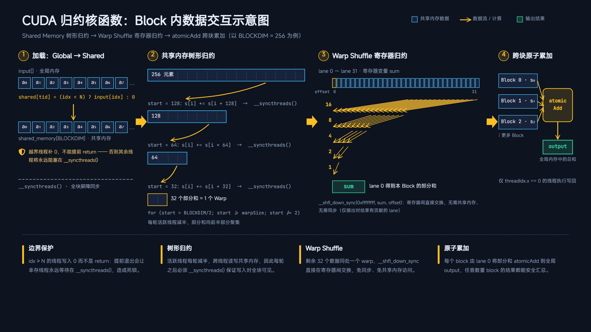

# reduction

最近在刷`LeetGPU`算子题，碰到了规约问题，他是最经典的GPU优化教学案例，因为它涉及到各个维度之间的数据交互，所以对于他的优化路径几乎涵盖了所有GPU的优化手段。所以我想从微观到宏观梳理一下。

## 写在开始

```
Write a GPU program that performs parallel reduction on an array of 32-bit floating point numbers to compute their sum. The program should take an input array and produce a single output value containing the sum of all elements.

Implementation Requirements
Use only GPU native features (external libraries are not permitted)
The solve function signature must remain unchanged
The final result must be stored in the output variable
Example 1:
Input: [1.0, 2.0, 3.0, 4.0, 5.0, 6.0, 7.0, 8.0]
Output: 36.0
```

第一次看到这个题的话，很显而易见的可以想到一些解题思路：

每个`thread`负责一个元素，然后在`block`内求和以后再进行`block`之间的求和。

所以问题很容易想到：

1. 怎么在`block`内求和
   - 通用思路是借助`block`的共享内存，先把需要的数据搬到共享内存上，然后设置相应的步长，进行相加求和。这里可以利用warp规约进行加速计算

1. 怎么在`block`间求和
   - 很简单，为了避免多个线程访问同一元素，可以使用原子操作进行串行执行。

所以基础题解如下：

```c++
__global__ void reduction(const float* input, float* output, int N){
    int idx = blockDim.x * blockIdx.x + threadIdx.x;
    __shared__ float shared_memory[BLOCKDIM];
    shared_memory[threadIdx.x] = (idx < N) ? input[idx] : 0.0f ; //不能使用return，因为会越界访问 if(idx >= N) return;
    __syncthreads();
    for(int start = BLOCKDIM/2; start >= warpSize ; start/=2){
        if(threadIdx.x < start){
            shared_memory[threadIdx.x] += shared_memory[threadIdx.x + start];
        }
        __syncthreads();
    }
    //现在数据集中在一个block中的一个wrap中，就可以使用寄存器进行加速计算了
    if(threadIdx.x < warpSize){
        float sum = shared_memory[threadIdx.x];
        unsigned  mask = 0xffffffff;  // 选择wrap中的哪些lane参与计算
        sum += __shfl_down_sync(mask,sum,16);
        sum += __shfl_down_sync(mask,sum,8);
        sum += __shfl_down_sync(mask,sum,4);
        sum += __shfl_down_sync(mask,sum,2);
        sum += __shfl_down_sync(mask,sum,1);
        if(threadIdx.x == 0){
            atomicAdd(output,sum);
        }
    }

}
```



## 算法复杂度

规约计算的理论成本其实就只是内存读取（O(n)次），计算占比微乎其微，所以所有的优化目标是**让DRAM带宽利用率逼近硬件峰值**。

如果带宽已经打满，任何 kernel 层面的优化都无济于事——`memory bound`类算子的物理极限。

## 线程级

1. 线程粗化

对于`memory bound`类算子来说，让每个线程处理多个元素可以大大缓解带宽压力，这样貌似很反直觉，对于我这样的初学者来说，一致认为的是尽可能地并行执行会更快。但是这样是对`compute bound`的情况来说的，规约这种算子本身计算占比很小，所以优化重点要放在访存上。所以最大化的单项收益是进行串行累加，让每个线程处理多个元素，把归约开销进行摊薄。

这个要考虑的是K 取多大：太小摊薄不够，太大占用率下降、并行度不足（经验值 4~16）。

2. 向量化加载

这个优化方法是老朋友了。`float4` / `int4` 一次取 128 bit，让一条加载指令完成 4 次工作，且内存事务对齐合并。

优化如下：
```c
const float4* v = reinterpret_cast<const float4*>(input + head_num);
    const int num = (N - head_num) >> 2; //除以四，有多少个线程处理这些数据
    for(int i = idx;i<num;i+=stride){
        float4 input_a= v[idx];
        sum += input_a.x + input_a.y + input_a.z + input_a.w;
    }
```


## 访存级

1. 内存合并

尽量让一个` warp` 的 32 个线程访问**连续且对齐**的地址 → 硬件合并成最少的内存事务。

## wrap级

1. 用`shuffle`代替共享内存

- 寄存器直传，**零访存、零显式同步**
- 替代后：块内同步次数从 `O(log blockDim) `次降到 1 次
- warp 内归约**永远应该用 shuffle**，没有例外

## block级

1. 减少 `__syncthreads()`

每次块同步都强制全 block 等最慢的线程。可以使用两阶段规约把多次同步压成一次。（warp 归约 → 一次同步 → warp 0 收尾）

2. ` Shared memory` 尺寸最小化

从 512 float 压到 8 float（每 warp 一个）——shared memory 是按 SM 分配的驻留资源，占用越大，可驻留的 block 越少，占用率越低。

优化：

```c
//2.第一次warp规约
    sum = warp_reduce_sum(sum);
    __shared__ float mem[BLOCKDIM/32];
    if(lane == 0 ) mem[warp_id] = sum ;
    __syncthreads();
    //3.第二次warp规约
    // 由 warp0 做最后规约
    float block_sum = 0.f;
    if (warp_id == 0) {
        block_sum = (tid < warps) ? mem[lane] : 0.f;
        block_sum = warp_reduce_sum(block_sum);
        if (lane == 0) atomicAdd(output, block_sum);
    }

```


## grid级

1. 降低原子操作竞争

毕竟是串行。

## 最后版本

```c++
#include <cuda_runtime.h>
#include <stdint.h>  

#define BLOCKDIM  512
#define  mask  0xffffffff  // 选择wrap中的哪些lane参与计算

__inline__ __device__ float warp_reduce_sum(float sum){
    sum += __shfl_down_sync(mask,sum,16);
    sum += __shfl_down_sync(mask,sum,8);
    sum += __shfl_down_sync(mask,sum,4);
    sum += __shfl_down_sync(mask,sum,2);
    sum += __shfl_down_sync(mask,sum,1);
    return sum;
}

__global__ void reduction(const float* input, float* output, int N){
    int idx = blockDim.x * blockIdx.x + threadIdx.x;
    const int tid      = threadIdx.x;
    const int lane     = tid & 31;
    const int warp_id  = tid >> 5;             // 0..(BS/32-1)
    const int warps    = BLOCKDIM / 32;
    //1.向量化加载，每个线程先处理四个元素
    const int misalign = (int)(reinterpret_cast<uintptr_t>(input) & 15u); //取尾数位，也就是只会是4/8/12,没有对齐的字节数
    const int head_num = misalign ? (16-misalign)/4 : 0; //需要处理的多出来的个数，可以先处理，也可以留到尾部处理
    float sum = 0.0f;
    const int stride = blockDim.x * gridDim.x ;
    //处理多的最多三个数据，16字节对齐
    if(idx < head_num){
        sum += input[idx];
    }
    //剩下的都是对齐的

    const float4* v = reinterpret_cast<const float4*>(input + head_num);
    const int num = (N - head_num) >> 2; //除以四，有多少个线程处理这些数据
    for(int i = idx;i<num;i+=stride){
        float4 input_a= v[idx];
        sum += input_a.x + input_a.y + input_a.z + input_a.w;
    }
    // 处理尾部剩余（N-head_num 不是 4 的倍数时）   
    int tail_start = head_num + num * 4;
    for (int i = tail_start + idx; i < N; i += stride) {
        sum += input[i];
    }     
        

    //2.第一次warp规约
    sum = warp_reduce_sum(sum);
    __shared__ float mem[BLOCKDIM/32];
    if(lane == 0 ) mem[warp_id] = sum ;
    __syncthreads();
    //3.第二次warp规约
    // 由 warp0 做最后规约
    float block_sum = 0.f;
    if (warp_id == 0) {
        block_sum = (tid < warps) ? mem[lane] : 0.f;
        block_sum = warp_reduce_sum(block_sum);
        if (lane == 0) atomicAdd(output, block_sum);
    }


}

// input, output are device pointers
extern "C" void solve(const float* input, float* output, int N) {
    reduction<<<(N+BLOCKDIM-1)/BLOCKDIM,BLOCKDIM>>>(input,output,N);
}

```

